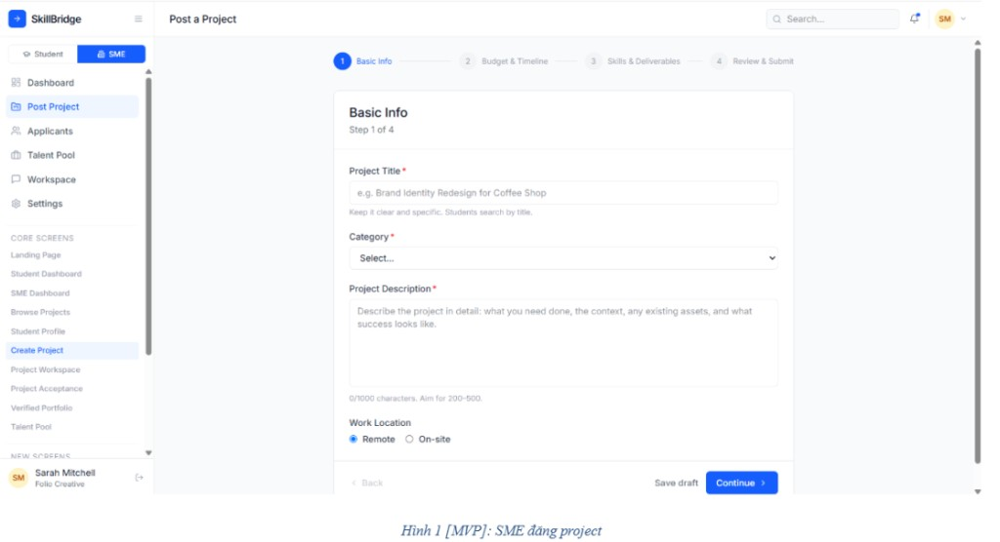
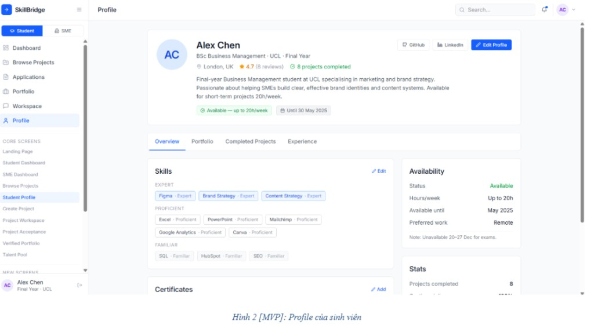
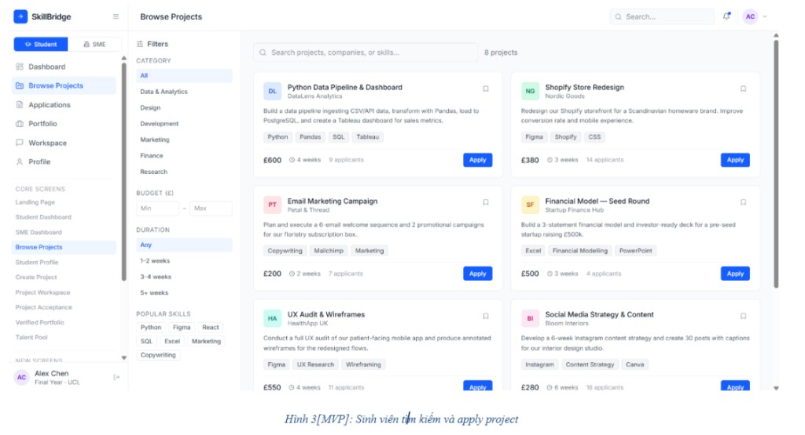
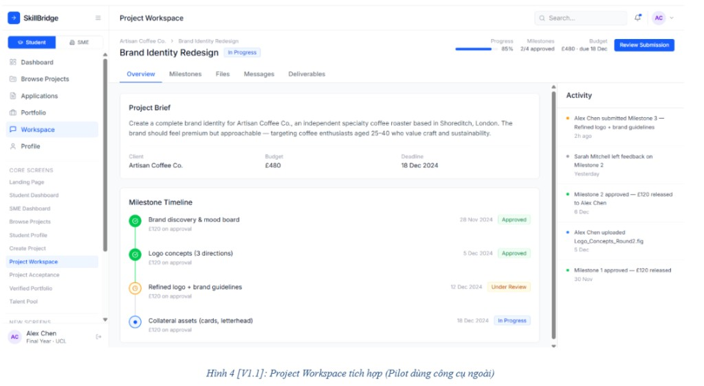
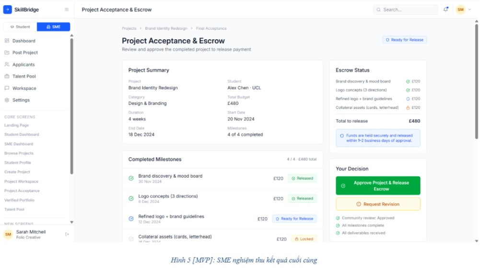
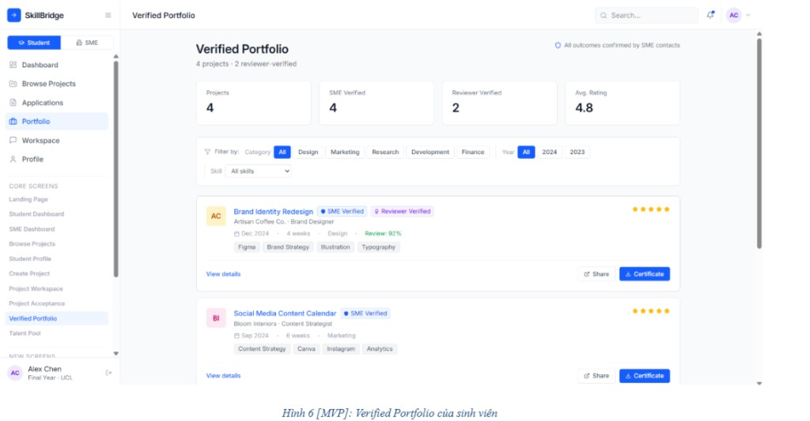
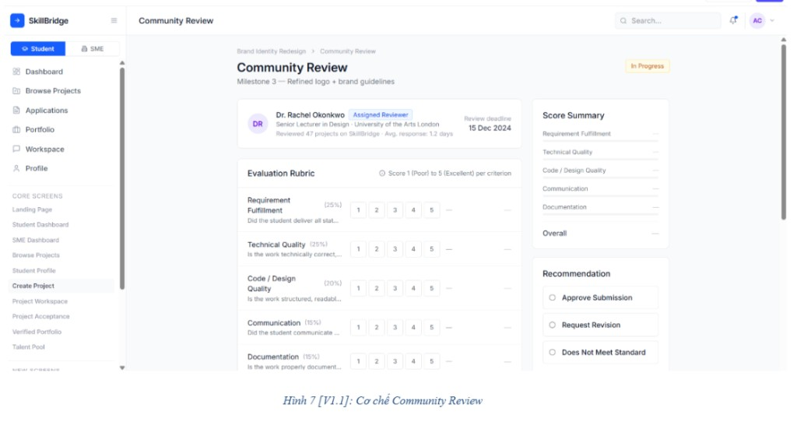
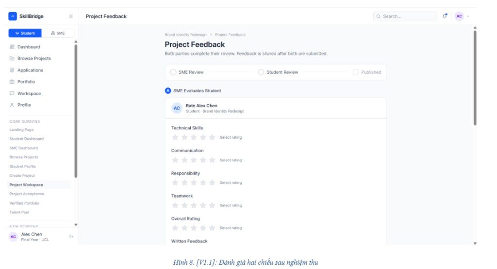

# SkillBridge — Prototype UI Specification

> **Nguồn sự thật UI** cho mọi task frontend. Ưu tiên file này thay vì phải mở lại ảnh gốc.  
> Prototype gốc: Vercel mockups (8 màn).  
> Cập nhật: **2026-07-27** · Nhánh tham chiếu: `ha`

---

## 0. Phạm vi MVP vs V1.1

| # | File ảnh | Tên màn | Scope |
| :-: | :---- | :---- | :---- |
| 1 | [`prototype/01-sme-post-project.png`](./prototype/01-sme-post-project.png) | SME đăng project | **MVP** |
| 2 | [`prototype/02-student-profile.png`](./prototype/02-student-profile.png) | Profile sinh viên | **MVP** |
| 3 | [`prototype/03-browse-apply.png`](./prototype/03-browse-apply.png) | Browse + Apply | **MVP** |
| 4 | [`prototype/04-project-workspace-v11.png`](./prototype/04-project-workspace-v11.png) | Project Workspace | **V1.1** (Pilot: tool ngoài) |
| 5 | [`prototype/05-acceptance-escrow.png`](./prototype/05-acceptance-escrow.png) | SME nghiệm thu + Escrow | **MVP** |
| 6 | [`prototype/06-verified-portfolio.png`](./prototype/06-verified-portfolio.png) | Verified Portfolio | **MVP** |
| 7 | [`prototype/07-community-review-v11.png`](./prototype/07-community-review-v11.png) | Community Review | **V1.1** |
| 8 | [`prototype/08-two-way-feedback-v11.png`](./prototype/08-two-way-feedback-v11.png) | Feedback 2 chiều | **V1.1** |

**Rule implement:** Chỉ bám pixel/layout MVP (1, 2, 3, 5, 6). V1.1 ghi nhận để không lệch kiến trúc, **không** bắt buộc code trong sprint 25–28/7.

---

## 1. Design System toàn cục

### 1.1 Shell layout (mọi màn)

```
┌──────────────────────────────────────────────────────────┐
│ Top bar: Logo | Page title          Search | Bell | Avatar │
├────────┬─────────────────────────────────────────────────┤
│ Sidebar│                                                 │
│ ~240px │              Main canvas (bg gray)              │
│        │              Content cards (white)              │
│        │                                                 │
└────────┴─────────────────────────────────────────────────┘
```

| Layer | Spec |
| :---- | :---- |
| **Canvas** | `#F4F5F7` / `#F7F8FA` — nền xám rất nhạt |
| **Surface / Card** | `#FFFFFF` — border `1px #E4E7EC`, radius `8–12px`, shadow rất nhẹ |
| **Sidebar** | Width ~240px, white, border-right `#E4E7EC` |
| **Top bar** | Height ~56–64px, white, border-bottom mỏng |
| **Content padding** | ~24px quanh main; gap giữa card ~16–24px |

### 1.2 Role switcher (sidebar top)

- 2 pill cạnh nhau: `Student` | `SME`
- Active: nền primary blue, chữ trắng, radius full/~8px
- Inactive: nền `#F2F4F7`, chữ `#475467`

### 1.3 Navigation item

- Icon 16–18px outline + label 14px medium
- Active: nền `#EFF4FF` / blue-50, chữ + icon primary
- Padding item: `10–12px 12px`, radius `8px`
- Group label phụ (CORE SCREENS): uppercase 11px, `#98A2B3`, tracking wide

### 1.4 Color tokens (map code)

| Token | Hex (prototype) | Dùng cho |
| :---- | :---- | :---- |
| `--brand-primary` | `#2563EB` ≈ `#155EEF` (code hiện tại) | CTA, active nav, links |
| `--brand-primary-hover` | `#1D4ED8` / `#1849A9` | Hover CTA |
| `--bg-canvas` | `#F7F8FA` | Page background |
| `--bg-surface` | `#FFFFFF` | Cards |
| `--text-primary` | `#101828` / `#172B4D` | Titles |
| `--text-secondary` | `#475467` / `#6B778C` | Meta |
| `--text-muted` | `#98A2B3` | Hints |
| `--border-default` | `#E4E7EC` | Card/input border |
| `--success` | `#12B76A` / `#36B37E` | Approved, Released, Available |
| `--warning` | `#F79009` / `#FFAB00` | Under review, Locked, Request revision |
| `--danger` | `#F04438` | Errors / reject |
| `--info` | `#2E90FA` | Ready for release (outline badge) |

### 1.5 Typography

| Role | Size | Weight | Color |
| :---- | :---- | :---- | :---- |
| Page title (H1) | 24–28px | 700–800 | text-primary |
| Section title (H2) | 16–18px | 700 | text-primary |
| Card title | 16px | 700 | text-primary |
| Body | 13–14px | 400 | text-secondary |
| Meta / caption | 11–12px | 500 | text-muted |
| Breadcrumb | 12px | 500 | text-muted |
| Button | 13–14px | 600 | white / secondary |

Font stack: system sans (Segoe UI / Inter-like). **Không** dùng display serif.

### 1.6 Components dùng lại

| Component | Spec |
| :---- | :---- |
| **Primary button** | bg primary, white text, radius 8px, h ~36–40px, px 16 |
| **Secondary button** | white + border, text-secondary |
| **Success button** | green `#12B76A` (Approve & Release Escrow) |
| **Warning outline** | orange text + border (Request Revision) |
| **Status pill** | radius full, px 10–12, py 4, text 11–12px bold |
| **Skill tag** | gray-50 bg, border, radius 6px, 11–12px |
| **Input** | h ~40px, radius 8px, border default, focus ring primary 2px |
| **Avatar initials** | circle, pastel bg (blue/mint/peach/purple), bold initials |
| **Company tile** | square ~36–40px, radius 8px, pastel bg + 2-letter initials |

---

## 2. Hình 1 [MVP] — SME Post a Project



### 2.1 Mục đích
SME tạo bài đăng project theo wizard nhiều bước.

### 2.2 Layout layers
1. Shell (sidebar SME + top “Post a Project”)
2. **Stepper** ngang 4 bước trên đầu content
3. **Form card** trắng lớn (Basic Info)
4. Footer actions trong card: Back (disabled) | Save draft | Continue

### 2.3 Stepper (4 steps)
1. Basic Info ← active (số trong vòng tròn primary)
2. Budget & Timeline
3. Skills & Deliverables
4. Review & Submit

- Active: circle filled primary + label đậm
- Inactive: circle gray border + label muted
- Connector line mỏng giữa các step

### 2.4 Step 1 fields
| Field | UI |
| :---- | :---- |
| Project Title * | Input, placeholder ví dụ JD ngắn; helper dưới field |
| Category * | Select “Select...” |
| Project Description * | Textarea lớn; counter `0/1000`; hint 200–500 |
| Work Location | Radio: Remote (default) / On-site |

### 2.5 Mapping code hiện tại
- Route: `/sme/post-project`, `/projects/create`
- Component: `ProjectForm.tsx` (đã có multi-step milestones — giữ logic, chỉnh visual stepper nếu lệch)

---

## 3. Hình 2 [MVP] — Student Profile



### 3.1 Mục đích
Hồ sơ công khai/ cá nhân sinh viên: skills theo tier, availability, stats.

### 3.2 Layout layers
1. Shell (Student active)
2. **Profile header card**: avatar lớn + name + education + location + GitHub/LinkedIn + Edit Profile
3. Trust row: star rating + “N projects completed”
4. Bio paragraph
5. Availability pills (green Available + gray Until date)
6. Tabs: Overview | Portfolio | Completed Projects | Experience
7. 2-cột dưới Overview:
   - Trái: Skills (Expert / Proficient / Familiar) + Certificates
   - Phải: Availability detail card + Stats card

### 3.3 Skills visual
- Expert: outline primary blue tags
- Proficient: gray outline
- Familiar: lighter gray

### 3.4 Mapping code
- Route: `/student/profile/[id]` (Day 28 Thịnh hoàn thiện portfolio tab)
- MVP tối thiểu: header + skills tiers + edit

---

## 4. Hình 3 [MVP] — Browse & Apply *(Hà Day 26 — ưu tiên UI)*



### 4.1 Mục đích
Sinh viên khám phá project OPEN, filter, bấm Apply.

### 4.2 Layout layers
```
Main
├── Page title: "Browse Projects"
├── Search bar rộng (placeholder Search projects, companies, or skills...) + count "N projects"
└── Grid  [ Filters sidebar | Project cards 2-col ]
```

### 4.3 Filters sidebar
| Block | UI |
| :---- | :---- |
| Title | “Filters” + gear icon |
| Category | List chips/rows: All (active), Data & Analytics, Design, Development, Marketing… |
| Budget | Min / Max inputs (prototype £ — MVP có thể VND) |
| Duration | Chips: Any, 1–2 weeks, 3–4 weeks, 5+ weeks |
| Popular Skills | Tag cloud clickable |

### 4.4 Project card anatomy
1. Top: company initials tile (pastel) + bookmark icon
2. Title (bold 16px)
3. Company name (12px muted)
4. Description 2 dòng
5. Skill tags row
6. Footer: budget · duration · applicant count | **Apply** primary button

### 4.5 Mapping code
- `/student/browse`, `/projects`
- `ProjectCard.tsx`, `ProjectFilter.tsx`
- Apply → detail `/student/projects/[id]` + `ApplyModal.tsx` **hoặc** Apply nhanh từ card

---

## 5. Hình 4 [V1.1] — Project Workspace



### 5.1 Scope
V1.1 — Pilot dùng tool ngoài; MVP có thể thay bằng trang milestones đơn giản `/projects/:id/milestones`.

### 5.2 Layers (tham khảo)
- Header: breadcrumb SME > Project, status In Progress, progress %, milestones X/Y, budget, Review Submission
- Tabs: Overview | Milestones | Files | Messages | Deliverables
- Left: Project Brief + Milestone Timeline dọc
- Right: Activity feed

**Không implement full trong sprint hiện tại.**

---

## 6. Hình 5 [MVP] — Acceptance & Escrow *(Hà Day 27 escrow UI + Thịnh accept)*



### 6.1 Mục đích
SME xem summary, trạng thái ký quỹ theo mốc, quyết định Approve & Release hoặc Request Revision.

### 6.2 Layout layers
```
Breadcrumb: Projects > {title} > Final Acceptance
Header: title + subtitle + status pill "Ready for Release"
Grid 2/3 + 1/3:
  Left:
    - Project Summary card (grid meta)
    - Completed Milestones list (status Released / Ready / Locked)
  Right:
    - Escrow Status card (per-milestone £/VND + total)
    - Your Decision card (Approve green + Request Revision orange + checklist)
```

### 6.3 Escrow status semantics (prototype)
| Visual | Meaning (map API) |
| :---- | :---- |
| Green check / Released | Milestone ACCEPTED / portion released |
| Blue Ready | Sẵn sàng giải ngân |
| Orange Locked | Còn HELD / chưa đủ điều kiện |
| Total to release | = project budget khi full release |

### 6.4 Decision checklist (prototype)
- Community review: Approved *(V1.1 — MVP có thể ẩn hoặc “N/A”)*
- All milestones complete
- All deliverables received

### 6.5 Mapping code
- `/escrow/[id]` — Hà: deposit/release/status + badge
- Accept/Revise API — Thịnh Day 27; UI nút Revision có thể disable/stub đến khi API sẵn

---

## 7. Hình 6 [MVP] — Verified Portfolio



### 7.1 Layers
1. Title + count “N projects · M reviewer-verified”
2. 4 stat cards: Projects / SME Verified / Reviewer Verified / Avg Rating
3. Filter chips: Category + Year + Skill dropdown
4. Entry cards: thumb initials, title link, SME Verified badge, meta, skill tags, stars, View details / Share / **Certificate**

### 7.2 Mapping
- Day 28 Thịnh (portfolio API) + Hà (certificate button → certificate page)

---

## 8. Hình 7 [V1.1] — Community Review



### 8.1 Tóm tắt
Assigned reviewer + rubric 1–5 (5 criteria weighted) + Score Summary + Recommendation radios.

**Out of MVP.**

---

## 9. Hình 8 [V1.1] — Two-way Feedback



### 9.1 Tóm tắt
Progress: SME Review → Student Review → Published. Star ratings 5 criteria + written feedback.

**Out of MVP.**

---

## 10. Checklist UI theo owner (MVP)

### Hà (Day 26–27) — phải khớp prototype
- [x] Browse layout + filter list + card Apply (Hình 3)
- [x] ApplyModal style primary blue (Hình 3 flow)
- [x] Applicants list dùng token/card prototype (không có hình riêng → inherit DS)
- [x] Escrow / Acceptance page layout (Hình 5)
- [x] EscrowBadge pills (Held / Released / Pending)

### Thịnh (Day 25–28) — tham chiếu khi làm
- [ ] Post Project stepper visual (Hình 1)
- [ ] Student Profile header + skill tiers (Hình 2)
- [ ] Acceptance actions wire API (Hình 5 decision)
- [ ] Verified Portfolio page (Hình 6)

---

## 11. Quy tắc khi làm UI task mới

1. Xác định màn thuộc **MVP hay V1.1** (bảng §0).
2. Đọc section tương ứng + xem ảnh markdown ngay trong file.
3. Dùng token §1 — **không** invent purple glow / cream serif.
4. Giữ shell sidebar + topbar nhất quán; chỉ đổi main content.
5. Copy/screenshot regression: so với ảnh trong `docs/prototype/`.

---

## 12. Đường dẫn ảnh tuyệt đối trong repo

```
docs/prototype/
  01-sme-post-project.png
  02-student-profile.png
  03-browse-apply.png
  04-project-workspace-v11.png
  05-acceptance-escrow.png
  06-verified-portfolio.png
  07-community-review-v11.png
  08-two-way-feedback-v11.png
```
