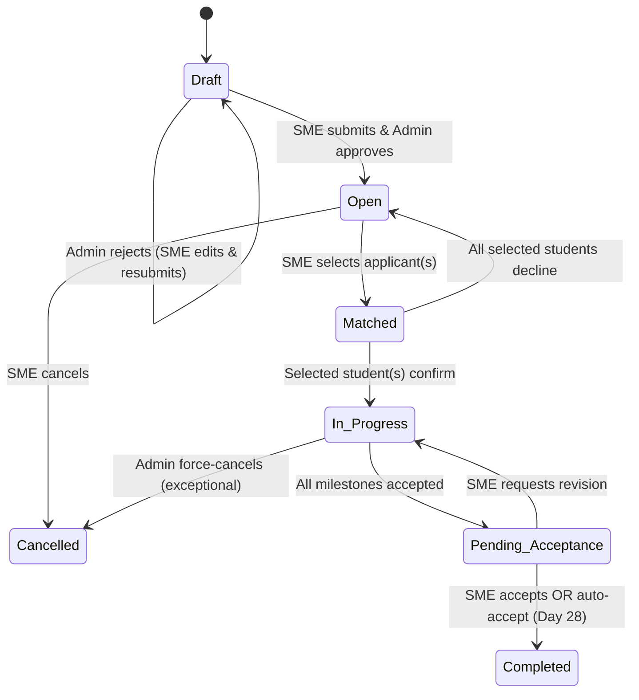
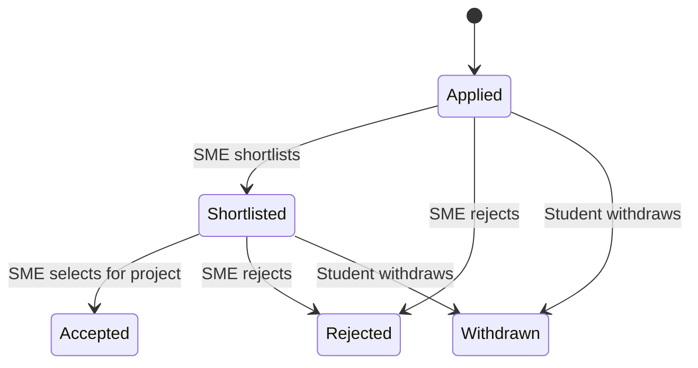
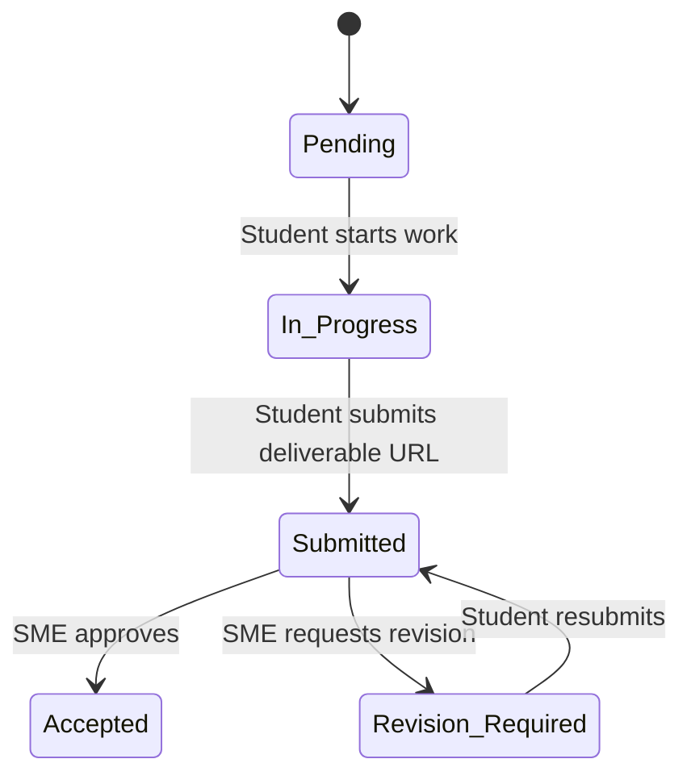
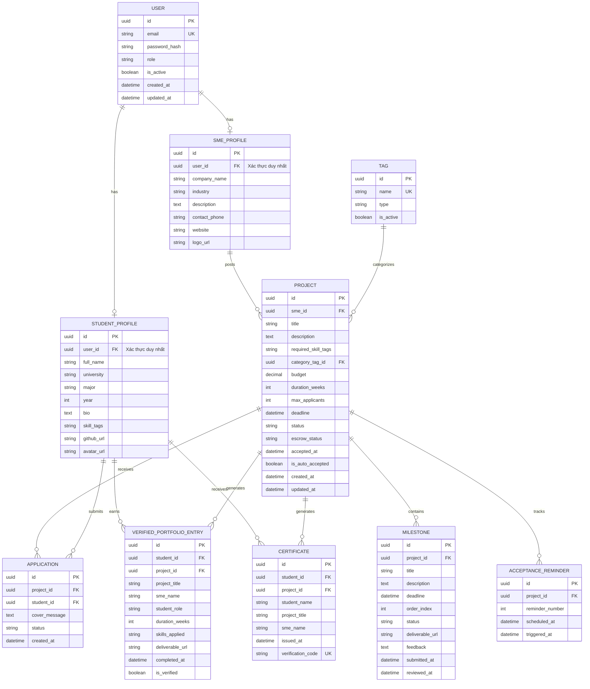

# Software Requirements Specification (SRS)

## SkillBridge — MVP / Pilot (Q3/2026)

| Field            | Value                                     |
| :--------------- | :---------------------------------------- |
| **Document ID**  | SRS-SKILLBRIDGE-MVP-001                   |
| **Version**      | 3.0                                       |
| **Date**         | 2026-07-16                                |
| **Authors**      | SkillBridge Engineering Team              |
| **Status**       | Final                                     |

---

## Table of Contents

1. [Introduction](#1-introduction)
2. [User Roles](#2-user-roles)
3. [Status Lifecycles & Business Rules](#3-status-lifecycles--business-rules)
4. [Functional Requirements](#4-functional-requirements)
5. [Validation Rules](#5-validation-rules)
6. [Permission Matrix](#6-permission-matrix)
7. [Non-Functional Requirements](#7-non-functional-requirements)
8. [Use Cases](#8-use-cases)
9. [Data Models](#9-data-models)
10. [API Specification](#10-api-specification)
11. [External Interfaces](#11-external-interfaces)
12. [Constraints & Assumptions](#12-constraints--assumptions)
13. [Appendices](#13-appendices)

---

## 1. Introduction

### 1.1 Purpose

This document specifies the software requirements for the **SkillBridge MVP** — a project-based marketplace connecting university students (Year 2–4, IT & Business majors) with SMEs in Ho Chi Minh City through short-term projects (1–4 weeks).

**Core hypothesis to validate**: *Are SMEs willing to post real projects, and are students willing to complete them through SkillBridge?*

### 1.2 MVP Scope

```
SME posts project → Students apply individually → System recommends by skill tags
→ SME selects applicants → Milestone tracking → Acceptance → Verified Portfolio & Certificate
```

**Out of scope** (deferred to future versions):

- AI Matching (MVP uses predefined skill-tag filtering only)
- Real Escrow payment (MVP uses simulated status)
- File upload (MVP uses deliverable URLs only)
- Email notifications, In-app notifications
- Community Review, Two-way rating, Talent Pool
- Integrated workspace (use Google Drive / GitHub / Discord)
- Mobile App, University API, Analytics Dashboard, Expert Network, Internal Chat

### 1.3 MVP Functions

| # | Function                         | Description                                                    |
|---|----------------------------------|----------------------------------------------------------------|
| 1 | Project Posting (SME)            | SMEs create project listings with predefined skill tags        |
| 2 | Student Skill Profile            | Students create profiles with predefined skill tags            |
| 3 | Project Application              | Students apply **individually** (no team entities)             |
| 4 | Matching                         | System recommends by tag overlap; SME selects 1–4 applicants   |
| 5 | Milestone Tracking               | Progress tracking via milestones; deliverable URLs             |
| 6 | Escrow (Simulated)               | Status simulation only: Pending → Locked → Released            |
| 7 | Acceptance                       | SME accepts/revises; auto-accept after 28-day timeout          |
| 8 | Verified Portfolio & Certificate | Auto-generated portfolio entry + digital certificate           |

### 1.4 Glossary

| Term                   | Definition                                                              |
| :--------------------- | :---------------------------------------------------------------------- |
| **SME**                | Small and Medium Enterprise — demand side                               |
| **Student**            | University student (Year 2–4) — supply side                             |
| **Project**            | Short-term task (1–4 weeks), budget ~1–5M VND                           |
| **Milestone**          | Checkpoint within a project with a deliverable URL and deadline         |
| **Escrow (Simulated)** | Simulated payment holding via status flags only (no real transactions)  |
| **Matching**           | System recommends applicants by skill-tag overlap; SME selects manually |
| **Verified Portfolio** | Internal SkillBridge portfolio of completed projects (not a CV/resume)  |
| **Acceptance**         | SME reviews and approves final deliverables, or system auto-accepts     |
| **Predefined Tags**    | Platform-managed skill/category tags (no free-text tags in MVP)         |

### 1.5 References

- [Business Plan — SkillBridge (PA3)](./Business_Plan_Updated_PA3.md)
- [System Architecture Document](./System_Architecture.md)
- [Coding Standards](./Source_Code_Documentation.md)

---

## 2. User Roles

### 2.1 Student (Supply Side)

| Aspect              | Details                                                                   |
| :------------------ | :------------------------------------------------------------------------ |
| **Characteristics** | Year 2–4, IT/Business major, tech-savvy, mobile & web user               |
| **Registration**    | Email, university name, major, year                                       |
| **Profile**         | Full name, bio, predefined skill tags, GitHub URL                         |
| **Actions**         | Browse projects, apply individually, submit milestone deliverable URLs, receive certificate |

### 2.2 SME (Demand Side)

| Aspect              | Details                                                                   |
| :------------------ | :------------------------------------------------------------------------ |
| **Characteristics** | Small business owner/founder, limited tech expertise, budget-conscious    |
| **Registration**    | Company name, industry, contact info                                      |
| **Actions**         | Post projects with predefined tags, review applications, select 1–4 applicants, track milestones, accept deliverables |

### 2.3 Admin (Platform Operator)

| Aspect              | Details                                                                   |
| :------------------ | :------------------------------------------------------------------------ |
| **Characteristics** | Founding team member                                                      |
| **Actions**         | Approve/reject project postings, assist matching when necessary, manage users, monitor KPIs |

---

## 3. Status Lifecycles & Business Rules

### 3.1 Project Status



| Status               | Description                                                    |
| :------------------- | :------------------------------------------------------------- |
| `DRAFT`              | Project created by SME, not yet approved by Admin              |
| `OPEN`               | Approved and visible to students for applications              |
| `MATCHED`            | SME has selected applicant(s), awaiting student confirmation   |
| `IN_PROGRESS`        | Student(s) confirmed, project work has started                 |
| `PENDING_ACCEPTANCE` | All milestones accepted; awaiting SME final acceptance         |
| `COMPLETED`          | SME accepted (or auto-accepted); portfolio & certificate issued|
| `CANCELLED`          | Cancelled by SME (before matching) or Admin (exceptional)      |

### 3.2 Application Status



| Status        | Description                                                         |
| :------------ | :------------------------------------------------------------------ |
| `APPLIED`     | Student has submitted the application                               |
| `SHORTLISTED` | SME has marked the application for further review                  |
| `ACCEPTED`    | SME has selected this student to work on the project                |
| `REJECTED`    | SME has declined the application                                    |
| `WITHDRAWN`   | Student has withdrawn before being accepted                         |

**Rules:**
- A student MAY withdraw only while status is `APPLIED` or `SHORTLISTED`
- Once `ACCEPTED`, the application cannot be withdrawn
- When the project transitions to `MATCHED`, all non-accepted applications are auto-set to `REJECTED`

### 3.3 Milestone Status



| Status              | Description                                                    |
| :------------------ | :------------------------------------------------------------- |
| `PENDING`           | Milestone defined but work has not started                     |
| `IN_PROGRESS`       | Student is actively working on this milestone                  |
| `SUBMITTED`         | Student has submitted a deliverable URL for SME review         |
| `ACCEPTED`          | SME has approved the deliverable                               |
| `REVISION_REQUIRED` | SME has requested changes; student must update and resubmit    |

**Rules:**
- A student MUST provide a deliverable URL when submitting
- Once all milestones reach `ACCEPTED`, the project auto-transitions to `PENDING_ACCEPTANCE`

### 3.4 Escrow Status (Simulated)

| Status    | Trigger                                         | Description                                   |
| :-------- | :---------------------------------------------- | :-------------------------------------------- |
| `PENDING` | Project created                                 | No payment action taken                       |
| `LOCKED`  | Project transitions to `IN_PROGRESS`            | Simulates funds held in escrow                |
| `RELEASED`| Project transitions to `COMPLETED`              | Simulates funds released to student           |

> [!IMPORTANT]
> **No real financial transactions occur in the MVP.** Escrow is purely a status field in the database. Real payment gateway integration (VNPay/Momo) is planned for a future version.

### 3.5 Acceptance Workflow & Timeout Rules

When a project reaches `PENDING_ACCEPTANCE`:

1. **SME has 3 actions:**
   - **Accept** → Project status → `COMPLETED`. Triggers: escrow → `RELEASED`, portfolio entry created, certificate generated
   - **Request Revision** → Last milestone → `REVISION_REQUIRED`. Project → `IN_PROGRESS`. Student updates and resubmits
   - **No response** → Timeout rules apply (see below)

2. **Timeout Business Rules (no email/notification implementation in MVP):**

| Day | Action                                                                                |
| :-: | :------------------------------------------------------------------------------------ |
| 7   | System records Reminder #1 (logged as business event; **no email sent in MVP**)       |
| 14  | System records Reminder #2 with auto-accept warning (logged; **no email sent in MVP**)|
| 28  | System **auto-accepts** the project. Escrow → `RELEASED`. Portfolio + Certificate generated. Project marked `COMPLETED (Auto-Accepted)` |

> [!NOTE]
> Email and notification features are **not part of the MVP**. Timeout reminders are documented as business rules only. The system implements the Day 28 auto-accept as a scheduled task.

---

## 4. Functional Requirements

### 4.1 Authentication & Authorization

| ID         | Requirement                                                               | Priority |
| :--------- | :------------------------------------------------------------------------ | :------: |
| FR-AUTH-01 | Users SHALL register as either **Student** or **SME**                     | Must     |
| FR-AUTH-02 | Users SHALL authenticate via email/password                               | Must     |
| FR-AUTH-03 | The system SHALL issue JWT tokens for session management                  | Must     |
| FR-AUTH-04 | The system SHALL enforce role-based access control (Student, SME, Admin)  | Must     |
| FR-AUTH-05 | Users SHALL be able to reset passwords via email                          | Must     |

### 4.2 Student Profile Management

| ID         | Requirement                                                               | Priority |
| :--------- | :------------------------------------------------------------------------ | :------: |
| FR-PROF-01 | Students SHALL create and edit their profile                              | Must     |
| FR-PROF-02 | Profile SHALL include: full name, university, major, year, bio, GitHub URL| Must     |
| FR-PROF-03 | Students SHALL select skills from a **predefined tag list** (no free-text)| Must     |
| FR-PROF-04 | Profile SHALL display the student's Verified Portfolio                    | Must     |
| FR-PROF-05 | Profile SHALL be viewable by SMEs during application review               | Must     |

### 4.3 Project Posting (SME)

| ID         | Requirement                                                               | Priority |
| :--------- | :------------------------------------------------------------------------ | :------: |
| FR-PROJ-01 | SMEs SHALL create project postings                                        | Must     |
| FR-PROJ-02 | Posting SHALL include: title, description, budget (VND), duration (weeks), milestones | Must |
| FR-PROJ-03 | SMEs SHALL select required skills from the **predefined tag list**        | Must     |
| FR-PROJ-04 | SMEs SHALL select a project category from the **predefined tag list**     | Must     |
| FR-PROJ-05 | Posting SHALL include milestones with title, description, and deadline    | Must     |
| FR-PROJ-06 | Posting SHALL require Admin approval before publishing (status: `DRAFT` → `OPEN`) | Must |
| FR-PROJ-07 | SMEs SHALL edit projects while status is `DRAFT` or `OPEN`. When edit while status is `OPEN`, the project will be re-published after Admin approval  | Must     |
| FR-PROJ-08 | SMEs SHALL cancel projects while status is `OPEN` (no applicants accepted)| Must    |
| FR-PROJ-09 | SMEs SHALL specify maximum accepted applicants (1–4)                     | Must     |

### 4.4 Predefined Tags

| ID         | Requirement                                                               | Priority |
| :--------- | :------------------------------------------------------------------------ | :------: |
| FR-TAG-01  | The system SHALL provide a predefined list of skill tags                  | Must     |
| FR-TAG-02  | The system SHALL provide a predefined list of project category tags       | Must     |
| FR-TAG-03  | Tags SHALL be managed by Admin (add/edit/disable)                        | Must     |
| FR-TAG-04  | Students and SMEs SHALL only select from predefined tags (no free-text)   | Must     |

**Initial predefined tags (seed data):**

| Type     | Tags                                                                    |
| :------- | :---------------------------------------------------------------------- |
| Skill    | HTML, CSS, JavaScript, TypeScript, React, Node.js, Python, Java, SQL, Git, Figma, Adobe XD, Google Ads, SEO, Content Writing, Video Editing, Data Analysis, Excel |
| Category | Frontend, Backend, Full-stack, UI/UX, Mobile, AI/ML, Marketing, Content, Business, Data |

### 4.5 Project Application (Student)

| ID          | Requirement                                                              | Priority |
| :---------- | :----------------------------------------------------------------------- | :------: |
| FR-APPLY-01 | Students SHALL browse projects with status `OPEN`                       | Must     |
| FR-APPLY-02 | Students SHALL filter/search by predefined skill tags, category, budget, duration | Must |
| FR-APPLY-03 | Students SHALL apply **individually** (no team/group application entity) | Must     |
| FR-APPLY-04 | Application SHALL include an optional cover message                     | Must     |
| FR-APPLY-05 | Students SHALL withdraw applications while status is `APPLIED` or `SHORTLISTED` | Must |

### 4.6 Matching

| ID          | Requirement                                                              | Priority |
| :---------- | :----------------------------------------------------------------------- | :------: |
| FR-MATCH-01 | System SHALL recommend applicants ranked by **predefined skill-tag overlap** (not AI) | Must |
| FR-MATCH-02 | Recommendation SHALL compare project `required_skills` with student `skills` tags | Must |
| FR-MATCH-03 | SMEs SHALL view the ranked applicant list with skill-match scores        | Must     |
| FR-MATCH-04 | SMEs SHALL shortlist, accept, or reject individual applicants            | Must     |
| FR-MATCH-05 | SMEs SHALL select **1 to `max_applicants`** students for the project     | Must     |
| FR-MATCH-06 | When SME confirms selection, project status SHALL transition to `MATCHED`| Must     |
| FR-MATCH-07 | Accepted students SHALL confirm participation before project starts      | Must     |
| FR-MATCH-08 | Admin SHALL be able to manually assist matching when necessary           | Must     |

**Matching workflow summary:**

1. SME creates project with predefined skill tags → Admin approves → `OPEN`
2. Students apply individually
3. System recommends applicants based on skill-tag overlap (simple intersection count)
4. SME reviews applicant list (sorted by match score)
5. SME shortlists → accepts 1–4 students
6. Project → `MATCHED`; accepted students confirm → `IN_PROGRESS`

### 4.7 Milestone Tracking

| ID          | Requirement                                                              | Priority |
| :---------- | :----------------------------------------------------------------------- | :------: |
| FR-MILE-01  | Each project SHALL have predefined milestones set during project creation| Must     |
| FR-MILE-02  | Each milestone SHALL have: title, description, deadline, order index     | Must     |
| FR-MILE-03  | Students SHALL submit a **deliverable URL** for each milestone           | Must     |
| FR-MILE-04  | Deliverable URL examples: GitHub repo, Figma link, Google Drive, YouTube, website URL | Must |
| FR-MILE-05  | The system SHALL NOT support file upload for deliverables in MVP         | Must     |
| FR-MILE-06  | SMEs SHALL review and accept or request revision for submitted milestones| Must     |
| FR-MILE-07  | System SHALL display milestone overview and statuses for both parties    | Must     |
| FR-MILE-08  | When all milestones reach `ACCEPTED`, project SHALL auto-transition to `PENDING_ACCEPTANCE` | Must |

### 4.8 Escrow (Simulated)

| ID         | Requirement                                                               | Priority |
| :--------- | :------------------------------------------------------------------------ | :------: |
| FR-ESC-01  | System SHALL maintain escrow status: `PENDING` → `LOCKED` → `RELEASED`  | Must     |
| FR-ESC-02  | Project entering `IN_PROGRESS` SHALL trigger escrow status `LOCKED`      | Must     |
| FR-ESC-03  | Project entering `COMPLETED` SHALL trigger escrow status `RELEASED`      | Must     |
| FR-ESC-04  | Escrow status SHALL be visible to both SME and Student                   | Must     |
| FR-ESC-05  | **No real financial transactions** SHALL occur in MVP                    | Must     |

### 4.9 Acceptance

| ID          | Requirement                                                              | Priority |
| :---------- | :----------------------------------------------------------------------- | :------: |
| FR-ACPT-01  | When project reaches `PENDING_ACCEPTANCE`, SME SHALL review deliverables| Must     |
| FR-ACPT-02  | SME SHALL accept the project → triggers completion flow                 | Must     |
| FR-ACPT-03  | SME SHALL request revision → last milestone becomes `REVISION_REQUIRED` → project returns to `IN_PROGRESS` | Must |
| FR-ACPT-04  | Completion flow SHALL trigger: escrow `RELEASED`, portfolio entry created, certificate generated | Must |
| FR-ACPT-05  | System SHALL auto-accept after **28 days** of no SME response           | Must     |
| FR-ACPT-06  | System SHALL log reminder events at Day 7 and Day 14 (business rule; **no email/notification in MVP**) | Must |
| FR-ACPT-07  | System SHALL mark project as `COMPLETED` after acceptance or auto-accept| Must     |

### 4.10 Verified Portfolio & Certificate

| ID          | Requirement                                                              | Priority |
| :---------- | :----------------------------------------------------------------------- | :------: |
| FR-PORT-01  | Acceptance SHALL auto-create an entry in the student's Verified Portfolio| Must     |
| FR-PORT-02  | Portfolio entry SHALL include: project title, SME name, student role, duration, skills applied, deliverable link, completion date, verification badge | Must |
| FR-PORT-03  | The Verified Portfolio is an **internal SkillBridge portfolio** (not a CV/resume) | Must |
| FR-PORT-04  | Students SHALL view and share their portfolio publicly via a unique URL  | Must     |
| FR-PORT-05  | System SHALL generate a digital certificate (PDF or in-app display)     | Must     |
| FR-PORT-06  | Certificate SHALL include: student name, project title, SME name, completion date, verification code | Must |

---

## 5. Validation Rules

### 5.1 Project Validation

| Rule                                          | Constraint                              |
| :-------------------------------------------- | :-------------------------------------- |
| Budget                                        | Must be > 0                             |
| Duration                                      | 1–8 weeks                               |
| Deadline                                      | Must be > current date                  |
| Required skills                               | 1–10 predefined tags                    |
| Category                                      | Exactly 1 predefined category tag       |
| Milestones                                    | At least 1, at most 10                  |
| Max accepted applicants (`max_applicants`)    | 1–4                                     |
| Title                                         | 5–200 characters                        |
| Description                                   | 20–5000 characters                      |

### 5.2 Application Validation

| Rule                                          | Constraint                              |
| :-------------------------------------------- | :-------------------------------------- |
| Duplicate application                         | A student SHALL NOT apply to the same project twice |
| Profile completeness                          | Student profile MUST be complete before applying (full name, university, major, year, at least 1 skill tag) |
| Project status                                | Application only allowed when project status is `OPEN` |
| Cover message                                 | 0–2000 characters                       |

### 5.3 Milestone Validation

| Rule                                          | Constraint                              |
| :-------------------------------------------- | :-------------------------------------- |
| Deliverable URL on submit                     | MUST be provided (non-empty, valid URL format) |
| Title                                         | 3–200 characters                        |
| Description                                   | 10–2000 characters                      |
| Deadline                                      | Must be ≤ project deadline              |

### 5.4 Student Profile Validation

| Rule                                          | Constraint                              |
| :-------------------------------------------- | :-------------------------------------- |
| Full name                                     | Required, 2–100 characters              |
| University                                    | Required                                |
| Major                                         | Required                                |
| Year                                          | 1–6                                     |
| Skills                                        | 1–15 predefined tags                    |
| Bio                                           | 0–2000 characters                       |

---

## 6. Permission Matrix

| Function                       | Student | SME         | Admin |
| :----------------------------- | :-----: | :---------: | :---: |
| **Authentication**             |         |             |       |
| Register / Login               | ✅      | ✅          | —     |
| Reset password                 | ✅      | ✅          | ✅    |
| **Profile**                    |         |             |       |
| Create/edit own profile        | ✅      | ✅          | —     |
| View any student profile       | ✅      | ✅          | ✅    |
| View any SME profile           | ✅      | ✅          | ✅    |
| **Projects**                   |         |             |       |
| Browse/search projects         | ✅      | ✅          | ✅    |
| View project detail            | ✅      | ✅          | ✅    |
| Create project                 | ❌      | ✅          | ❌    |
| Edit own project               | ❌      | ✅ (owner)  | ❌    |
| Cancel own project             | ❌      | ✅ (owner)  | ✅    |
| Approve/reject project posting | ❌      | ❌          | ✅    |
| **Applications**               |         |             |       |
| Apply to project               | ✅      | ❌          | ❌    |
| View own applications          | ✅      | ❌          | ❌    |
| View project applications      | ❌      | ✅ (owner)  | ✅    |
| Withdraw own application       | ✅      | ❌          | ❌    |
| Shortlist/accept/reject applicant| ❌    | ✅ (owner)  | ✅    |
| **Matching**                   |         |             |       |
| View recommendations           | ❌      | ✅ (owner)  | ✅    |
| Confirm match (select students)| ❌      | ✅ (owner)  | ✅    |
| Confirm participation          | ✅      | ❌          | ❌    |
| **Milestones**                 |         |             |       |
| View milestones                | ✅ (member) | ✅ (owner) | ✅  |
| Submit deliverable URL         | ✅ (member) | ❌         | ❌  |
| Accept/request revision        | ❌      | ✅ (owner)  | ✅    |
| **Acceptance**                 |         |             |       |
| Accept project                 | ❌      | ✅ (owner)  | ✅    |
| Request revision               | ❌      | ✅ (owner)  | ✅    |
| **Portfolio & Certificate**    |         |             |       |
| View own portfolio             | ✅      | ❌          | ❌    |
| View any student portfolio     | ✅      | ✅          | ✅    |
| Verify certificate (public)    | ✅      | ✅          | ✅    |
| **Admin**                      |         |             |       |
| Manage users                   | ❌      | ❌          | ✅    |
| Manage predefined tags         | ❌      | ❌          | ✅    |
| View platform KPIs             | ❌      | ❌          | ✅    |

---

## 7. Non-Functional Requirements

### 7.1 Performance

| ID          | Requirement                                                           | Priority |
| :---------- | :-------------------------------------------------------------------- | :------: |
| NFR-PERF-01 | Page load time SHALL be ≤ 3 seconds                                  | Must     |
| NFR-PERF-02 | API response time SHALL be ≤ 500ms (P95)                             | Must     |
| NFR-PERF-03 | System SHALL support ≥ 100 concurrent users                          | Must     |

### 7.2 Security

| ID          | Requirement                                                           | Priority |
| :---------- | :-------------------------------------------------------------------- | :------: |
| NFR-SEC-01  | Passwords SHALL be hashed (bcrypt or equivalent)                     | Must     |
| NFR-SEC-02  | All API endpoints SHALL enforce auth and authorization               | Must     |
| NFR-SEC-03  | All communications SHALL use HTTPS                                   | Must     |
| NFR-SEC-04  | JWT tokens SHALL have configurable expiration (default: 24h)         | Must     |
| NFR-SEC-05  | System SHALL protect against XSS, CSRF, SQL Injection                | Must     |

### 7.3 Scalability

| ID           | Requirement                                                          | Priority |
| :----------- | :------------------------------------------------------------------- | :------: |
| NFR-SCAL-01  | Architecture SHALL support horizontal scaling                        | Should   |
| NFR-SCAL-02  | Database design SHALL enable future microservice decomposition       | Should   |

### 7.4 Usability

| ID          | Requirement                                                           | Priority |
| :---------- | :-------------------------------------------------------------------- | :------: |
| NFR-USE-01  | UI SHALL be responsive on desktop and mobile browsers                | Must     |
| NFR-USE-02  | Key flows SHALL complete in ≤ 5 steps                                | Should   |
| NFR-USE-03  | System SHALL provide clear error messages and validation feedback    | Must     |
| NFR-USE-04  | Primary language: Vietnamese; secondary: English                     | Must     |

### 7.5 Reliability

| ID          | Requirement                                                           | Priority |
| :---------- | :-------------------------------------------------------------------- | :------: |
| NFR-REL-01  | System SHALL target 99% uptime during Pilot                          | Must     |
| NFR-REL-02  | System SHALL implement daily automated backups                       | Must     |

### 7.6 Maintainability

| ID           | Requirement                                                          | Priority |
| :----------- | :------------------------------------------------------------------- | :------: |
| NFR-MAIN-01  | Codebase SHALL follow [Coding Standards](./Source_Code_Documentation.md) | Must  |
| NFR-MAIN-02  | Unit test coverage SHALL be ≥ 60% for core modules                   | Should   |
| NFR-MAIN-03  | System SHALL use structured logging                                  | Should   |

---

## 8. Use Cases

### 8.1 UC-01: SME Posts a New Project

| Field             | Description                                                                   |
| :---------------- | :---------------------------------------------------------------------------- |
| **Actor**         | SME, Admin                                                                    |
| **Precondition**  | SME is registered and logged in                                               |
| **Main Flow**     | 1. SME navigates to "Post Project"<br>2. Fills in details: title, description, predefined skill tags, category tag, budget, duration, milestones (with title, description, deadline), max applicants (1–4)<br>3. System validates input (see §5.1)<br>4. SME submits → project status: `DRAFT`<br>5. Admin reviews and approves → status: `OPEN`<br>6. Project is visible to students |
| **Postcondition** | Project is published with status `OPEN`                                       |
| **Alt Flow A**    | **5a. Admin rejects** → SME receives rejection reason → SME edits and resubmits → returns to step 5 |
| **Alt Flow B**    | **3a. Validation fails** → System displays specific validation errors → SME corrects input → returns to step 3 |

### 8.2 UC-02: Student Applies to a Project

| Field             | Description                                                                   |
| :---------------- | :---------------------------------------------------------------------------- |
| **Actor**         | Student                                                                       |
| **Precondition**  | Student is registered, logged in, **profile is complete** (see §5.4)          |
| **Main Flow**     | 1. Browses project listings (status `OPEN`)<br>2. Optionally filters by predefined skill tags, category, budget, duration<br>3. Selects a project and views details<br>4. Clicks "Apply" and adds optional cover message<br>5. System validates (see §5.2)<br>6. Application recorded with status `APPLIED`<br>7. Application visible to SME |
| **Postcondition** | Application appears in SME's applicant list                                   |
| **Alt Flow A**    | **4a. Student profile is incomplete** → System blocks application → shows "Complete your profile" prompt |
| **Alt Flow B**    | **4b. Student has already applied** → System displays "Already applied" error |
| **Alt Flow C**    | **4c. Project is no longer `OPEN`** (deadline expired or status changed) → System displays "Project no longer accepting applications" |
| **Alt Flow D**    | **4d. Student withdraws** → Application status → `WITHDRAWN` (only if currently `APPLIED` or `SHORTLISTED`) |

### 8.3 UC-03: Matching — SME Selects Applicants

| Field             | Description                                                                   |
| :---------------- | :---------------------------------------------------------------------------- |
| **Actor**         | SME, Admin                                                                    |
| **Precondition**  | Project status is `OPEN`; at least one application exists                     |
| **Main Flow**     | 1. System generates recommendation list ranked by skill-tag overlap<br>2. SME reviews applicant profiles and match scores<br>3. SME shortlists candidates (status → `SHORTLISTED`)<br>4. SME accepts 1 to `max_applicants` students (status → `ACCEPTED`)<br>5. SME confirms selection → Project → `MATCHED`<br>6. All non-accepted applications auto-set to `REJECTED`<br>7. Accepted students confirm participation → Project → `IN_PROGRESS`; Escrow → `LOCKED` |
| **Postcondition** | Project is in progress with confirmed student(s)                              |
| **Alt Flow A**    | **7a. A student declines** → If remaining confirmed students ≥ 1, project proceeds. If 0 remain, project returns to `OPEN` |
| **Alt Flow B**    | **1a. Admin assists** → Admin may manually adjust recommendations or intervene in selection when necessary |

### 8.4 UC-04: Milestone Tracking & Submission

| Field             | Description                                                                   |
| :---------------- | :---------------------------------------------------------------------------- |
| **Actor**         | Student, SME                                                                  |
| **Precondition**  | Project status is `IN_PROGRESS`                                               |
| **Main Flow**     | 1. Student views milestone list<br>2. Student marks milestone as `IN_PROGRESS`<br>3. Student works on deliverable<br>4. Student submits **deliverable URL** → milestone status: `SUBMITTED`<br>5. SME reviews the deliverable URL<br>6. SME accepts → status: `ACCEPTED`<br>7. When all milestones reach `ACCEPTED` → project auto-transitions to `PENDING_ACCEPTANCE` |
| **Postcondition** | Milestone accepted; project may transition to `PENDING_ACCEPTANCE`            |
| **Alt Flow A**    | **6a. SME requests revision** → milestone → `REVISION_REQUIRED` → student updates deliverable URL → resubmits → returns to step 5 |
| **Alt Flow B**    | **4a. No deliverable URL provided** → System blocks submission with validation error |

### 8.5 UC-05: Project Acceptance & Completion

| Field             | Description                                                                   |
| :---------------- | :---------------------------------------------------------------------------- |
| **Actor**         | SME, System                                                                   |
| **Precondition**  | Project status is `PENDING_ACCEPTANCE` (all milestones `ACCEPTED`)            |
| **Main Flow**     | 1. SME reviews final deliverables<br>2. SME clicks "Accept Project"<br>3. Project → `COMPLETED`<br>4. Escrow → `RELEASED`<br>5. System creates Verified Portfolio entry for each accepted student<br>6. System generates certificate for each accepted student |
| **Postcondition** | Project completed; students have portfolio entries and certificates           |
| **Alt Flow A**    | **2a. SME requests revision** → Last milestone → `REVISION_REQUIRED` → Project → `IN_PROGRESS` → Student updates deliverable → Resubmits → Returns to precondition |
| **Alt Flow B**    | **2b. SME does not respond** → Day 7: System logs Reminder #1 → Day 14: System logs Reminder #2 → **Day 28: System auto-accepts** → Proceeds with steps 3–6 |

---

## 9. Data Models

### 9.1 Entity-Relationship Diagram



### 9.2 Key Enumerations

| Enum Name           | Values                                                                              |
| :------------------ | :---------------------------------------------------------------------------------- |
| `UserRole`          | `STUDENT`, `SME`, `ADMIN`                                                           |
| `ProjectStatus`     | `DRAFT`, `OPEN`, `MATCHED`, `IN_PROGRESS`, `PENDING_ACCEPTANCE`, `COMPLETED`, `CANCELLED` |
| `EscrowStatus`      | `PENDING`, `LOCKED`, `RELEASED`                                                     |
| `MilestoneStatus`   | `PENDING`, `IN_PROGRESS`, `SUBMITTED`, `ACCEPTED`, `REVISION_REQUIRED`              |
| `ApplicationStatus` | `APPLIED`, `SHORTLISTED`, `ACCEPTED`, `REJECTED`, `WITHDRAWN`                       |
| `TagType`           | `SKILL`, `CATEGORY`                                                                 |

### 9.3 Key Constraints

| Table          | Constraint                                        | Type   |
| :------------- | :------------------------------------------------ | :----- |
| `users`        | `email`                                           | Unique |
| `applications` | `(project_id, student_id)`                        | Unique |
| `certificates` | `verification_code`                               | Unique |
| `tags`         | `name`                                            | Unique |

---

## 10. API Specification

### 10.1 Authentication

| Method | Endpoint                       | Description            | Auth |
| :----- | :----------------------------- | :--------------------- | :--: |
| POST   | `/api/v1/auth/register`        | Register new user      | No   |
| POST   | `/api/v1/auth/login`           | Login, receive JWT     | No   |
| POST   | `/api/v1/auth/refresh`         | Refresh JWT            | Yes  |
| POST   | `/api/v1/auth/forgot-password` | Request password reset | No   |
| POST   | `/api/v1/auth/reset-password`  | Reset password         | No   |

### 10.2 Users & Profiles

| Method | Endpoint                      | Description                  | Auth | Role    |
| :----- | :---------------------------- | :--------------------------- | :--: | :------ |
| GET    | `/api/v1/users/me`            | Get current user             | Yes  | Any     |
| PUT    | `/api/v1/users/me`            | Update current user          | Yes  | Any     |
| GET    | `/api/v1/students/:id`        | Get student public profile   | Yes  | Any     |
| PUT    | `/api/v1/students/me/profile` | Update student profile       | Yes  | Student |
| GET    | `/api/v1/smes/:id`            | Get SME public profile       | Yes  | Any     |
| PUT    | `/api/v1/smes/me/profile`     | Update SME profile           | Yes  | SME     |

### 10.3 Tags

| Method | Endpoint               | Description             | Auth | Role  |
| :----- | :--------------------- | :---------------------- | :--: | :---- |
| GET    | `/api/v1/tags`         | List all active tags    | Yes  | Any   |
| GET    | `/api/v1/tags/skills`  | List skill tags only    | Yes  | Any   |
| GET    | `/api/v1/tags/categories` | List category tags only | Yes | Any  |
| POST   | `/api/v1/admin/tags`   | Create a new tag        | Yes  | Admin |
| PUT    | `/api/v1/admin/tags/:id`| Update/disable a tag   | Yes  | Admin |

### 10.4 Projects

| Method | Endpoint                      | Description                    | Auth | Role        |
| :----- | :---------------------------- | :----------------------------- | :--: | :---------- |
| GET    | `/api/v1/projects`            | List `OPEN` projects (filterable) | Yes | Any       |
| GET    | `/api/v1/projects/:id`        | Get project details            | Yes  | Any         |
| POST   | `/api/v1/projects`            | Create project (`DRAFT`)       | Yes  | SME         |
| PUT    | `/api/v1/projects/:id`        | Update project                 | Yes  | SME (owner) |
| DELETE | `/api/v1/projects/:id`        | Cancel project                 | Yes  | SME (owner) |

### 10.5 Applications

| Method | Endpoint                              | Description                      | Auth | Role        |
| :----- | :------------------------------------ | :------------------------------- | :--: | :---------- |
| POST   | `/api/v1/projects/:id/applications`   | Apply to project                 | Yes  | Student     |
| GET    | `/api/v1/projects/:id/applications`   | List applications for project    | Yes  | SME (owner) |
| GET    | `/api/v1/students/me/applications`    | List student's own applications  | Yes  | Student     |
| PUT    | `/api/v1/applications/:id/status`     | Shortlist/accept/reject          | Yes  | SME (owner) |
| DELETE | `/api/v1/applications/:id`            | Withdraw application             | Yes  | Student     |

### 10.6 Matching

| Method | Endpoint                               | Description                    | Auth | Role      |
| :----- | :------------------------------------- | :----------------------------- | :--: | :-------- |
| GET    | `/api/v1/projects/:id/recommendations` | Get ranked applicant list      | Yes  | SME/Admin |
| POST   | `/api/v1/projects/:id/match/confirm`   | Confirm selection → `MATCHED`  | Yes  | SME       |
| PUT    | `/api/v1/projects/:id/match/accept`    | Student confirms participation | Yes  | Student   |
| PUT    | `/api/v1/projects/:id/match/decline`   | Student declines               | Yes  | Student   |

### 10.7 Milestones

| Method | Endpoint                        | Description                 | Auth | Role    |
| :----- | :------------------------------ | :-------------------------- | :--: | :------ |
| GET    | `/api/v1/projects/:id/milestones`| List project milestones    | Yes  | Member  |
| PUT    | `/api/v1/milestones/:id/start`  | Mark as `IN_PROGRESS`       | Yes  | Student |
| PUT    | `/api/v1/milestones/:id/submit` | Submit deliverable URL      | Yes  | Student |
| PUT    | `/api/v1/milestones/:id/review` | Accept or request revision  | Yes  | SME     |

### 10.8 Acceptance & Portfolio

| Method | Endpoint                         | Description                    | Auth | Role   |
| :----- | :------------------------------- | :----------------------------- | :--: | :----- |
| POST   | `/api/v1/projects/:id/accept`    | Accept project                 | Yes  | SME    |
| POST   | `/api/v1/projects/:id/revision`  | Request revision               | Yes  | SME    |
| GET    | `/api/v1/students/:id/portfolio` | Get student's verified portfolio| Yes | Any    |
| GET    | `/api/v1/certificates/:code`     | Verify certificate by code     | No   | Public |

### 10.9 Admin

| Method | Endpoint                              | Description              | Auth | Role  |
| :----- | :------------------------------------ | :----------------------- | :--: | :---- |
| GET    | `/api/v1/admin/projects/pending`      | List `DRAFT` projects    | Yes  | Admin |
| PUT    | `/api/v1/admin/projects/:id/approve`  | Approve → `OPEN`         | Yes  | Admin |
| PUT    | `/api/v1/admin/projects/:id/reject`   | Reject with reason       | Yes  | Admin |
| GET    | `/api/v1/admin/stats`                 | Platform KPI dashboard   | Yes  | Admin |

---

## 11. External Interfaces

### 11.1 Key Screens

Home/Landing, Registration/Login, Student Dashboard, SME Dashboard, Project Listing/Search, Project Detail/Apply, Milestone Tracking, Profile Page (Student/SME), Admin Panel (project moderation, KPIs).

### 11.2 External Services

| Service        | Purpose                | MVP Priority |
| :------------- | :--------------------- | :----------: |
| PDF Generation | Completion certificates| Must         |

> [!NOTE]
> **Not in MVP scope**: Email (SMTP), Google OAuth, Cloud Storage. Students submit deliverable URLs (GitHub, Figma, Google Drive, etc.) instead of uploading files. Collaboration happens via external tools: Google Drive, GitHub, Discord.

---

## 12. Constraints & Assumptions

### 12.1 Constraints

1. **Budget**: Minimal; prefer free-tier cloud services
2. **Team Size**: 2 developers (CTO + CEO)
3. **Timeline**: MVP deployable by end of **September 2026** (Q3)
4. **No Real Payments**: Escrow simulated via status flags only
5. **No File Upload**: Deliverables via URL only (GitHub, Figma, Drive, etc.)
6. **No Notifications**: No email or in-app notifications in MVP
7. **Predefined Tags Only**: No free-text skill/category tags
8. **Pilot Scale**: ≤ 25 students, ≤ 8 SMEs, ≤ 10 projects in 8 weeks

### 12.2 Assumptions

1. Students have reliable internet and modern browsers
2. SMEs can articulate project requirements in structured form
3. Admin (founding team) available for project approval and matching support during Pilot
4. External collaboration tools (Google Drive, GitHub, Discord) are familiar to both user groups
5. Deliverable URLs (GitHub, Figma, etc.) are accessible to SMEs for review

### 12.3 Risks

| Risk                                    | Impact | Mitigation                                                |
| :-------------------------------------- | :----: | :-------------------------------------------------------- |
| Low SME engagement                      | High   | Seed projects from network; free pilot                    |
| Low student engagement                  | High   | Pre-launch community building; mock projects              |
| Quality issues in deliverables          | Medium | Structured milestones; admin support; SME review per step |
| SME non-response on acceptance          | Medium | 28-day auto-accept rule ensures project completion        |
| Technical debt from fast development    | Medium | Enforce coding conventions; refactor in future version    |

---

## 13. Appendices

### 13.1 MVP Success Criteria (Go/No-Go)

| KPI                          | Target                                    |
| :--------------------------- | :---------------------------------------- |
| Projects posted              | ≥ 10 in 8-week pilot                      |
| Application rate             | ≥ 3 applicants per project                |
| Matching success rate        | ≥ 60% of projects matched                 |
| Project completion rate      | ≥ 50% of matched projects                 |
| User willingness to reuse    | ≥ 70%                                     |
| **Pilot scope**              | 15–25 students, 5–8 SMEs, 8 weeks, HCMC   |

### 13.2 Future Enhancements (Not in MVP)

The following features are explicitly **excluded from MVP** and planned for future versions:

| Feature                  | Planned Version |
| :----------------------- | :-------------- |
| AI Matching              | V2.0            |
| Real Escrow (VNPay/Momo) | V1.1            |
| Email Notifications      | V1.1            |
| In-app Notifications     | V1.1            |
| File Upload              | V1.1            |
| Google OAuth             | V1.1            |
| Community Review         | V1.1            |
| Two-way Rating           | V1.1            |
| Talent Pool              | V1.1            |
| Integrated Workspace     | V1.1            |
| Internal Chat            | V2.0            |
| Mobile App               | V2.0            |
| University API           | V2.0            |
| Analytics Dashboard      | V1.1            |
| Expert Network           | V2.0            |

---

*End of SRS — SkillBridge MVP v3.0*
