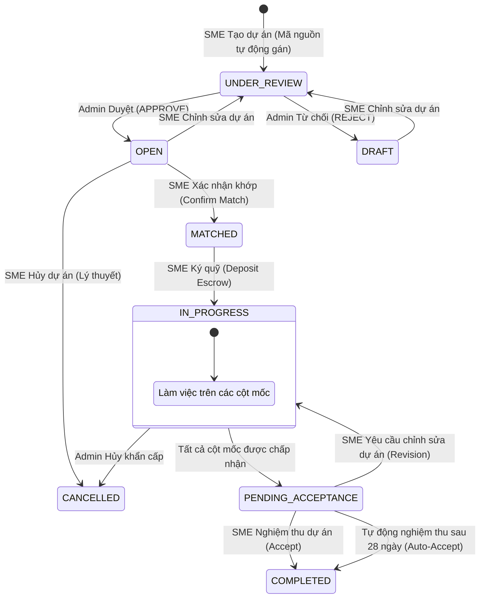

# BÁO CÁO THIẾT KẾ KIỂM THỬ CHUYỂN TRẠNG THÁI (STATE TRANSITION TESTING)
## Dự án: SkillBridge MVP

Tài liệu này trình bày thiết kế các ca kiểm thử chuyển trạng thái cho dự án SkillBridge dựa trên tài liệu đặc tả `SRS_MVP.md` và phân tích thực tế mã nguồn backend hiện tại.

---

## 1. Các Mô hình Chuyển trạng thái & Luật Nghiệp vụ

Hệ thống SkillBridge MVP quản lý trạng thái của 4 thực thể chính: **Project (Dự án)**, **Application (Đơn ứng tuyển)**, **Milestone (Cột mốc)**, và **Escrow (Ký quỹ mô phỏng)**.

### 1.1 Trạng thái Dự án (Project Status)
* **Các trạng thái:** `DRAFT`, `UNDER_REVIEW`, `OPEN`, `MATCHED`, `IN_PROGRESS`, `PENDING_ACCEPTANCE`, `COMPLETED`, `CANCELLED`.
* **Lưu đồ chuyển trạng thái (theo SRS & thực tế mã nguồn):**



### 1.2 Trạng thái Đơn ứng tuyển (Application Status)
* **Các trạng thái:** `APPLIED`, `SHORTLISTED`, `ACCEPTED`, `REJECTED`, `WITHDRAWN`.
* **Luật nghiệp vụ:**
  - Sinh viên chỉ được rút đơn (`WITHDRAWN`) khi trạng thái là `APPLIED` hoặc `SHORTLISTED`.
  - Khi một đơn ứng tuyển chuyển sang `ACCEPTED` (và SME hoàn tất Matching), các đơn ứng tuyển khác sẽ tự động chuyển thành `REJECTED`.
  - Sinh viên đã rút đơn (`WITHDRAWN`) có thể nộp lại dự án đó, trạng thái chuyển về `APPLIED`.

### 1.3 Trạng thái Cột mốc (Milestone Status)
* **Các trạng thái:** `PENDING`, `IN_PROGRESS`, `SUBMITTED`, `ACCEPTED`, `REVISION_REQUIRED`.
* **Luật nghiệp vụ:**
  - Cột mốc đầu tiên tự động chuyển thành `IN_PROGRESS` khi dự án chuyển thành `IN_PROGRESS`.
  - Sinh viên nộp URL sản phẩm (`SUBMITTED`). Sinh viên có thể hủy nộp trước khi SME duyệt (`PENDING`).
  - SME phê duyệt (`ACCEPTED`) hoặc yêu cầu chỉnh sửa (`REVISION_REQUIRED`).
  - Khi toàn bộ cột mốc đạt `ACCEPTED`, trạng thái dự án tự động chuyển sang `PENDING_ACCEPTANCE`.

### 1.4 Trạng thái Ký quỹ Mô phỏng (Escrow Status)
* **Các trạng thái:** `PENDING`, `HELD` (Tương đương `LOCKED` trong SRS), `RELEASED`.
* **Quy trình:**
  - Dự án tạo: `PENDING`.
  - SME nạp tiền ký quỹ sau khi Matching: `HELD`.
  - Nghiệm thu dự án hoặc hết hạn 28 ngày: `RELEASED`.

---

## 2. Thiết kế Ca kiểm thử chuyển trạng thái (State Transition Test Cases)

### 2.1 Kiểm thử Chuyển trạng thái Dự án (Project Status Tests)

| Mã TC | Trạng thái bắt đầu | Sự kiện / Đầu vào | Trạng thái mong muốn | Hành động API | Kết quả thực tế & Ghi chú |
| :--- | :--- | :--- | :--- | :--- | :--- |
| **TC-PROJ-01** | `[*] (Chưa có)` | Tạo dự án hợp lệ bởi SME | `UNDER_REVIEW` | `POST /api/projects` | **ĐẠT** |
| **TC-PROJ-02** | `UNDER_REVIEW` | Admin duyệt dự án (`APPROVE`) | `OPEN` | `PATCH /api/projects/:id/review` | **ĐẠT** |
| **TC-PROJ-03** | `UNDER_REVIEW` | Admin từ chối dự án (`REJECT`) | `DRAFT` | `PATCH /api/projects/:id/review` | **ĐẠT** |
| **TC-PROJ-04** | `DRAFT` | SME chỉnh sửa chi tiết dự án | `UNDER_REVIEW` | `PATCH /api/projects/:id` | **ĐẠT** |
| **TC-PROJ-05** | `OPEN` | SME chỉnh sửa chi tiết dự án | `UNDER_REVIEW` | `PATCH /api/projects/:id` | **ĐẠT** |
| **TC-PROJ-06** | `OPEN` | SME xác nhận Matching | `MATCHED` | `POST /api/applications/confirm-match` | **ĐẠT** |
| **TC-PROJ-07** | `MATCHED` | SME thực hiện ký quỹ ký thác | `IN_PROGRESS` | `POST /api/escrow/deposit` | **ĐẠT** |
| **TC-PROJ-08** | `IN_PROGRESS` | Phê duyệt cột mốc cuối cùng | `PENDING_ACCEPTANCE` | `PATCH /api/milestones/:id/review` | **ĐẠT** |
| **TC-PROJ-09** | `PENDING_ACCEPTANCE`| SME đồng ý nghiệm thu dự án | `COMPLETED` | `PATCH /api/projects/:id/accept` | **ĐẠT** |
| **TC-PROJ-10** | `PENDING_ACCEPTANCE`| SME yêu cầu sửa đổi dự án | `IN_PROGRESS` | `PATCH /api/projects/:id/revision` | **ĐẠT** (Cột mốc cuối trở về `REVISION_REQUIRED`) |
| **TC-PROJ-11** | `PENDING_ACCEPTANCE`| Giả lập Cron chạy sau 28 ngày | `COMPLETED` | `POST /api/projects/test/trigger-cron` | **ĐẠT** (Sinh ra portfolio, cert và `isAutoAccepted = true`) |
| **TC-PROJ-12** | `OPEN` | SME gửi cập nhật trạng thái `CANCELLED` | `CANCELLED` | `PATCH /api/projects/:id` (gửi `{ status: 'CANCELLED' }`) | **ĐẠT** (Thiếu kiểm soát luồng chuyển đổi trạng thái) |
| **TC-PROJ-13 (Negative)** | `IN_PROGRESS` | SME cố ý sửa trạng thái sang `COMPLETED` trực tiếp | Thất bại (400/403) | `PATCH /api/projects/:id` (gửi `{ status: 'COMPLETED' }`) | **LỖI (BUG-01)**: API chấp nhận cập nhật trạng thái tùy ý không qua kiểm duyệt. |

---

### 2.2 Kiểm thử Chuyển trạng thái Đơn ứng tuyển (Application Status Tests)

| Mã TC | Trạng thái bắt đầu | Sự kiện / Đầu vào | Trạng thái mong muốn | Hành động API | Kết quả thực tế & Ghi chú |
| :--- | :--- | :--- | :--- | :--- | :--- |
| **TC-APP-01** | `[*] (Chưa nộp)` | Sinh viên nộp đơn ứng tuyển | `APPLIED` | `POST /api/applications` | **ĐẠT** |
| **TC-APP-02** | `APPLIED` | SME đưa ứng viên vào shortlist | `SHORTLISTED` | `PATCH /api/applications/:id` | **ĐẠT** |
| **TC-APP-03** | `APPLIED` | SME từ chối ứng viên | `REJECTED` | `PATCH /api/applications/:id` | **ĐẠT** |
| **TC-APP-04** | `APPLIED` | Sinh viên tự rút đơn | `WITHDRAWN` | `POST /api/applications/:id/withdraw` | **ĐẠT** |
| **TC-APP-05** | `SHORTLISTED` | SME xác nhận tuyển dụng ứng viên | `ACCEPTED` | `PATCH /api/applications/:id` | **ĐẠT** |
| **TC-APP-06** | `SHORTLISTED` | Sinh viên tự rút đơn | `WITHDRAWN` | `POST /api/applications/:id/withdraw` | **ĐẠT** |
| **TC-APP-07** | `WITHDRAWN` | Sinh viên ứng tuyển lại cùng dự án| `APPLIED` | `POST /api/applications` | **ĐẠT** (Hệ thống tái sử dụng bản ghi và đổi trạng thái về Applied) |
| **TC-APP-08 (Negative)** | `ACCEPTED` | Sinh viên cố tình rút đơn | Thất bại (400) | `POST /api/applications/:id/withdraw` | **ĐẠT** (Bị hệ thống chặn đúng luật) |
| **TC-APP-09 (Negative)** | `WITHDRAWN` | SME cố tình đổi trạng thái thành `SHORTLISTED` | Thất bại (400) | `PATCH /api/applications/:id` | **ĐẠT** (Bị chặn đúng luật) |
| **TC-APP-10** | `APPLIED` | SME xác nhận khớp cho ứng viên khác | `REJECTED` | `POST /api/applications/confirm-match` | **ĐẠT** (Tự động chuyển các hồ sơ còn lại thành Rejected) |

---

### 2.3 Kiểm thử Chuyển trạng thái Cột mốc (Milestone Status Tests)

| Mã TC | Trạng thái bắt đầu | Sự kiện / Đầu vào | Trạng thái mong muốn | Hành động API | Kết quả thực tế & Ghi chú |
| :--- | :--- | :--- | :--- | :--- | :--- |
| **TC-MILE-01** | `PENDING` | Dự án chuyển sang `IN_PROGRESS` | Cột mốc 1 -> `IN_PROGRESS` | (Tự động khi SME ký quỹ) | **ĐẠT** |
| **TC-MILE-02** | `IN_PROGRESS` | Sinh viên nộp URL sản phẩm | `SUBMITTED` | `PATCH /api/milestones/:id/submit` | **ĐẠT** |
| **TC-MILE-03** | `SUBMITTED` | Sinh viên hủy nộp sản phẩm | `PENDING` | `PATCH /api/milestones/:id/cancel` | **ĐẠT** (Trạng thái và URL sản phẩm bị xóa) |
| **TC-MILE-04** | `SUBMITTED` | SME duyệt sản phẩm | `ACCEPTED` | `PATCH /api/milestones/:id/review` (APPROVE) | **ĐẠT** |
| **TC-MILE-05** | `SUBMITTED` | SME yêu cầu chỉnh sửa | `REVISION_REQUIRED` | `PATCH /api/milestones/:id/review` (REVISE) | **ĐẠT** |
| **TC-MILE-06** | `REVISION_REQUIRED` | Sinh viên cập nhật và nộp lại URL| `SUBMITTED` | `PATCH /api/milestones/:id/submit` | **ĐẠT** |
| **TC-MILE-07 (Negative)** | `ACCEPTED` | Sinh viên gửi đè/nộp lại sản phẩm| Thất bại (400) | `PATCH /api/milestones/:id/submit` | **ĐẠT** (Bị chặn đúng luật) |
| **TC-MILE-08 (Negative)** | `PENDING` | SME phê duyệt cột mốc chưa nộp | Thất bại (400) | `PATCH /api/milestones/:id/review` | **ĐẠT** (Bị chặn đúng luật) |

---

### 2.4 Kiểm thử Chuyển trạng thái Ký quỹ Mô phỏng (Escrow Status Tests)

| Mã TC | Trạng thái bắt đầu | Sự kiện / Đầu vào | Trạng thái mong muốn | Hành động API | Kết quả thực tế & Ghi chú |
| :--- | :--- | :--- | :--- | :--- | :--- |
| **TC-ESC-01** | `PENDING` (Chưa nạp) | SME ký quỹ sau khi tuyển chọn ứng viên | `HELD` | `POST /api/escrow/:projectId/deposit` | **ĐẠT** |
| **TC-ESC-02** | `HELD` (Đang giữ) | SME phê duyệt nghiệm thu dự án | `RELEASED` | `PATCH /api/projects/:id/accept` | **ĐẠT** |
| **TC-ESC-03** | `HELD` (Đang giữ) | Giả lập Cron tự động nghiệm thu sau 28 ngày | `RELEASED` | `POST /api/projects/test/trigger-cron` | **ĐẠT** |
| **TC-ESC-04** | `HELD` (Đang giữ) | SME gọi API giải ngân trực tiếp độc lập | `RELEASED` | `POST /api/escrow/:projectId/release` | **ĐẠT** |

---

## 3. Tổng hợp Lỗi và Sự sai khác so với Đặc tả (Bugs & Discrepancies Summary)

### Lỗi 1: Cho phép chỉnh sửa trạng thái tùy ý không qua kiểm duyệt (Vulnerability in Project Update)
* **Mô tả:** Endpoint `PATCH /api/projects/:id` (sử dụng bởi SME để cập nhật dự án) trực tiếp gán trường `status` nhận từ request body (`data.status`) vào cơ sở dữ liệu nếu dự án không ở trạng thái `OPEN` hoặc `DRAFT`.
* **Hậu quả:** SME có thể dễ dàng bypass quy trình bằng cách gửi request PATCH dự án đang ở `IN_PROGRESS` lên thành `COMPLETED` trực tiếp mà không cần sinh viên hoàn thành các cột mốc, hoặc đưa ngược trở lại `OPEN` dù dự án đã khớp.
* **Đoạn mã gây lỗi:** Trong [project.service.ts](file:///c:/Users/Public/Projects/SkillBridge/backend/src/modules/projects/project.service.ts#L196-L200):
  ```typescript
  if (project.status === ProjectStatus.OPEN || project.status === ProjectStatus.DRAFT) {
    updateData.status = ProjectStatus.UNDER_REVIEW;
  } else if (data.status) {
    updateData.status = data.status; // LỖI: Gán trực tiếp không qua kiểm tra tính hợp lệ của luồng chuyển trạng thái
  }
  ```

### Sự sai khác 2: Thiếu bước xác nhận/từ chối tham gia của Sinh viên (Missing Student Confirmation Flow)
* **Mô tả:** Tài liệu đặc tả `SRS_MVP.md` yêu cầu luồng chuyển trạng thái: `Matched --> In_Progress` khi "Selected student(s) confirm" (Sinh viên xác nhận) và quay lại `Open` nếu "All selected students decline" (Từ chối). Tuy nhiên, trong mã nguồn backend hiện tại:
  - Khi SME thực hiện nạp tiền ký quỹ mô phỏng (`depositEscrow`), trạng thái dự án tự động nhảy sang `IN_PROGRESS`.
  - Không tồn tại API hay cột cơ sở dữ liệu nào lưu trạng thái xác nhận hoặc từ chối tham gia của sinh viên sau khi được tuyển.
* **Hậu quả:** Hệ thống ép buộc sinh viên vào dự án ngay lập tức khi SME deposit tiền ký quỹ mà không cho sinh viên cơ hội từ chối hay chọn lựa dự án khác.

### Sự sai khác 3: Thuật ngữ trạng thái Ký quỹ (Escrow Status Terminology)
* **Mô tả:** Trong tài liệu đặc tả SRS, trạng thái Escrow được định nghĩa là: `PENDING` -> `LOCKED` -> `RELEASED`. Trong cơ sở dữ liệu (Prisma Schema) và mã nguồn API, trạng thái lại được đặt tên là: `PENDING` -> `HELD` -> `RELEASED` (có thêm trạng thái `NONE`).
* **Hậu quả:** Sự không đồng nhất về mặt tài liệu kỹ thuật có thể gây hiểu nhầm cho lập trình viên phát triển frontend hoặc viết kiểm thử tích hợp.

### Sự sai khác 4: Chưa triển khai tính năng Hủy dự án (Missing Project Cancellation Logic)
* **Mô tả:** Đặc tả yêu cầu SME có thể hủy dự án khi ở trạng thái `OPEN` (chưa có ứng viên được chấp nhận) chuyển sang `CANCELLED`. Nhưng hệ thống không có endpoint hủy riêng (`PATCH /api/projects/:id/cancel` hoặc tương đương). SME phải tự PATCH trạng thái `status: 'CANCELLED'` qua endpoint chỉnh sửa chung, dẫn tới lỗ hổng bảo mật/nghiệp vụ nếu dự án đã khớp.

---

## 4. Hướng khắc phục đề xuất (Proposed Fixes)

1. **Khắc phục Lỗi cập nhật trạng thái tùy ý (Bug 1):**
   * Chỉnh sửa hàm `updateProject` trong [project.service.ts](file:///c:/Users/Public/Projects/SkillBridge/backend/src/modules/projects/project.service.ts). Loại bỏ quyền tự do cập nhật trường `status` từ body gửi lên. Trạng thái dự án chỉ được cập nhật qua các API nghiệp vụ riêng biệt như `/accept`, `/revision`, `/review`, hoặc khi thực hiện ký quỹ.
   * Nếu vẫn cho phép chỉnh sửa trạng thái qua PATCH, cần bổ sung hàm kiểm tra tính hợp lệ của luồng chuyển đổi trạng thái (State Transition Guard), ví dụ chỉ cho phép đổi sang `CANCELLED` từ `OPEN` nếu không có ứng viên nào ở trạng thái `ACCEPTED`.

2. **Khắc phục Quy trình Xác nhận của Sinh viên (Sự sai khác 2):**
   * Bổ sung trường `participationConfirmed` (Boolean, mặc định false/null) vào bảng `Application` trong cơ sở dữ liệu.
   * Phát triển thêm 2 endpoint dành cho sinh viên có đơn ứng tuyển ở trạng thái `ACCEPTED`:
     - `POST /api/applications/:id/confirm`: Chuyển `participationConfirmed` thành `true`. Khi toàn bộ sinh viên được chọn xác nhận, dự án tự động chuyển sang `IN_PROGRESS` (sau khi đã deposit).
     - `POST /api/applications/:id/decline`: Chuyển trạng thái đơn ứng tuyển thành `WITHDRAWN` hoặc `REJECTED`. Nếu toàn bộ sinh viên được chọn từ chối, dự án tự động trả về `OPEN`.

3. **Thống nhất thuật ngữ Escrow (Sự sai khác 3):**
   * Cập nhật lại tài liệu SRS hoặc thực hiện ánh xạ (mapping) rõ ràng tại API Layer để chuyển `HELD` thành `LOCKED` khi trả về frontend.

4. **Triển khai endpoint Hủy dự án an toàn (Sự sai khác 4):**
   * Xây dựng API `PATCH /api/projects/:id/cancel` kiểm tra chặt chẽ: Chỉ chủ sở hữu dự án (SME) hoặc Admin mới được gọi; dự án phải đang ở trạng thái `OPEN` hoặc `UNDER_REVIEW` và chưa có bất kỳ đơn ứng tuyển nào được `ACCEPTED`.

---

## 5. Script kiểm thử chuyển trạng thái tự động

Mã nguồn kiểm thử tự động được triển khai tại file: [state-transition.test.ts](file:///c:/Users/Public/Projects/SkillBridge/tests/states-transition/state-transition.test.ts).

### Hướng dẫn chạy test:
1. Đảm bảo bạn đang ở thư mục gốc của backend `c:\Users\Public\Projects\SkillBridge\backend`.
2. Khởi chạy script kiểm thử chuyển trạng thái thông qua câu lệnh:
   ```bash
   node node_modules/ts-node/dist/bin.js --skip-project ../tests/states-transition/state-transition.test.ts
   ```
3. Kết quả chạy test sẽ in trực tiếp ra màn hình terminal, chỉ ra các ca kiểm thử chuyển trạng thái hợp lệ/không hợp lệ và chỉ rõ các bước bị lỗi do lỗ hổng cập nhật trạng thái trực tiếp của hệ thống.
